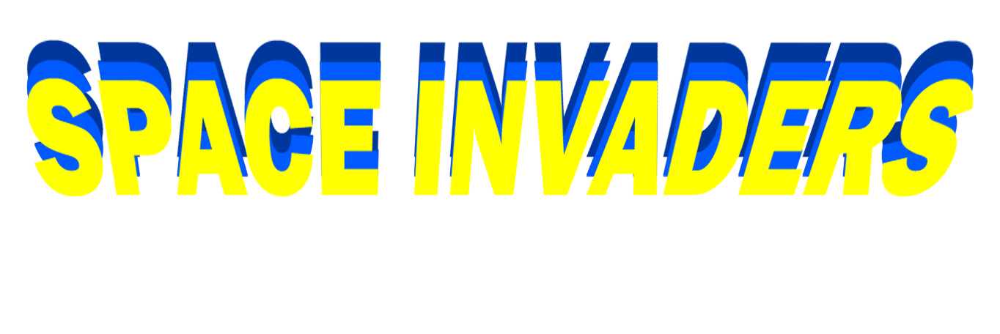
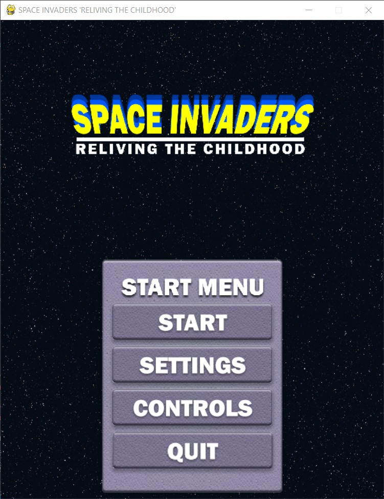
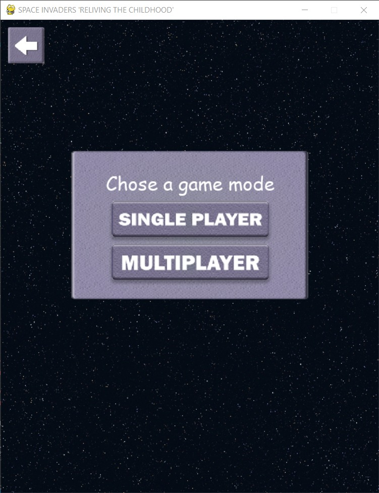
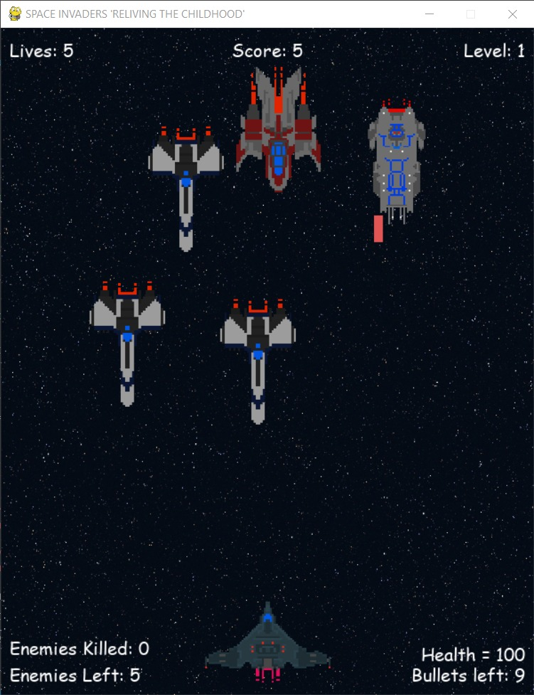
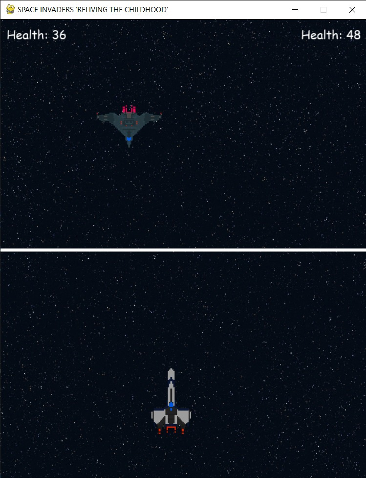
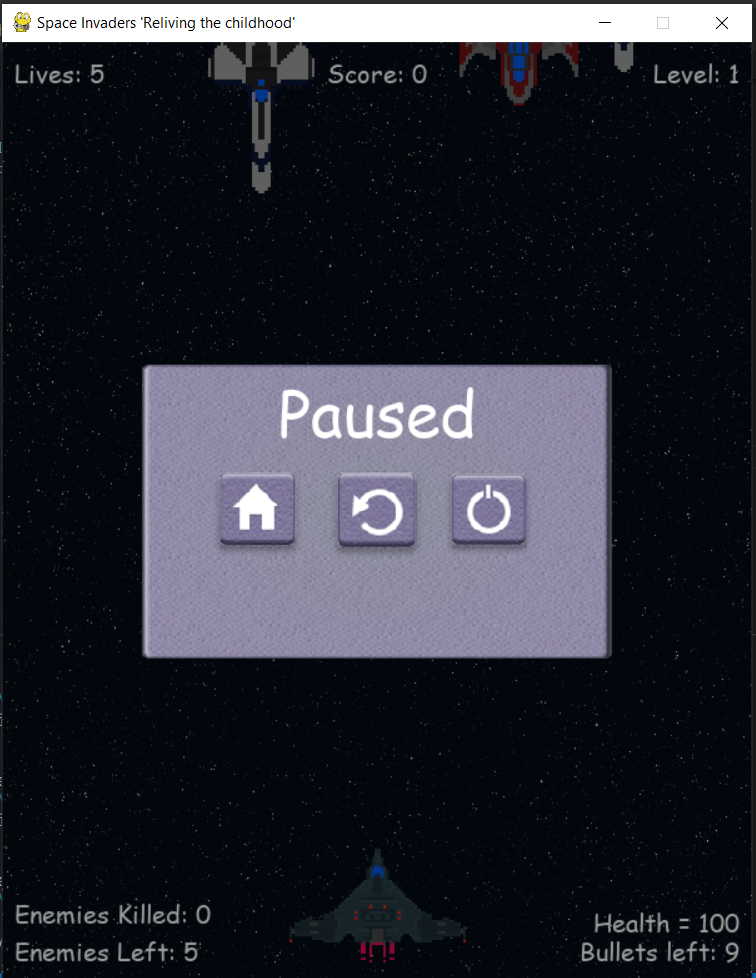
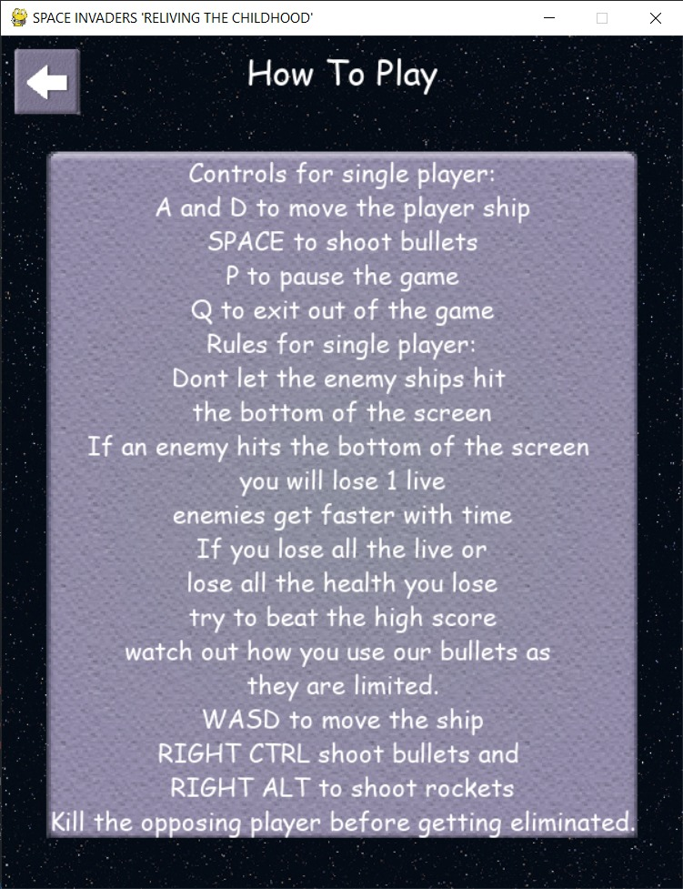
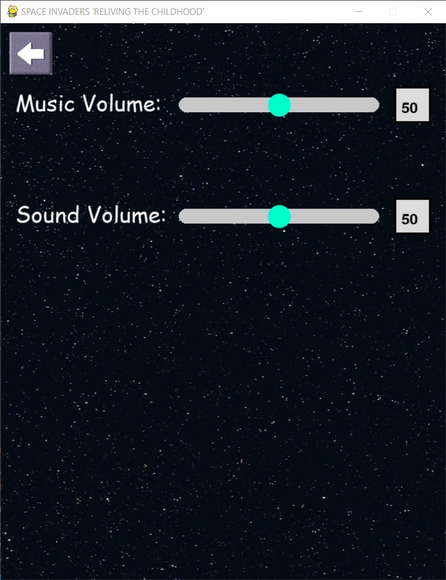

<div id="top"></div>


[![Contributors][contributors-shield]][contributors-url]
[![Forks][forks-shield]][forks-url]
[![Stargazers][stars-shield]][stars-url]
[![Issues][issues-shield]][issues-url]
[![MIT License][license-shield]][license-url]
[![LinkedIn][linkedin-shield]][linkedin-url]

<!-- PROJECT LOGO -->
<br />
<div align="center">
  <a href="https://github.com/othneildrew/Best-README-Template">
    
  </a>

  <h3 align="center">Space Invaders Reliving The Childhood</h3>

  <p align="center">
    <br />
    <a href="https://github.com/humamchoudhary/Space-invaders"><strong>Explore the docs »</strong></a>
    <br />
    <br />
    <a href="https://github.com/humamchoudhary/Space-invaders">View Demo</a>
    ·
    <a href="https://github.com/humamchoudhary/Space-invaders/issues">Report Bug</a>
    ·
    <a href="https://github.com/humamchoudhary/Space-invaders/issues">Request Feature</a>
  </p>
</div>

<!-- TABLE OF CONTENTS -->
<details>
  <summary>Table of Contents</summary>
  <ol>
    <li>
      <a href="#about-the-project">About The Project</a>
      <ul>
        <li><a href="#built-with">Built With</a></li>
      </ul>
    </li>
    <li>
      <a href="#getting-started">Getting Started</a>
      <ul>
        <li><a href="#prerequisites">Prerequisites</a></li>
        <li><a href="#installation">Installation</a></li>
      </ul>
    </li>
    <li><a href="#usage">Usage</a></li>
    <li><a href="#contributing">Contributing</a></li>
    <li><a href="#contact">Contact</a></li>
    <li><a href="#acknowledgments">Acknowledgments</a></li>
  </ol>
</details>

<!-- ABOUT THE PROJECT -->

## About The Project

A simple space invaders game made with pygthon. 
The following controls are for single player:
  - Player:
      - A "Move left"
      - D "Move right"
  - General:
      - P "Pause/unpause game"
      - Q "To quit game"
The following controls are for multiplayer mode:
  - Left player:
      - W "Move forwards"
      - S "Move backwards"
      - A "Move Up"
      - D "Move down"
      - R "Shoot rockets"
      - F "Shoot bullets"
  - Rigth player:
      - Up Arrow "Move forwards"
      - Down Arrow "Move backwards"
      - Left Arrow "Move Up"
      - Rigth Arrow "Move down"
      - RALT "Shoot rockets"
      - RCTRL "Shoot bullets"
  - Genral:
      - P "Pause/unpause game"

<p align="right">(<a href="#top">back to top</a>)</p>

### Built With

- [Pygame](https://www.pygame.org/)


<p align="right">(<a href="#top">back to top</a>)</p>

<!-- GETTING STARTED -->

## Getting Started

To setup this project locally on your computer follow the steps below.

### Installation


1. Clone the repo
   ```sh
   git clone https://github.com/humamchoudhary/Space-invaders.git
   ```

<p align="right">(<a href="#top">back to top</a>)</p>


### Prerequisites

- pip
  ```sh
  pip install pygame
  ```
## ScreenShots
  <strong>Main Menu</strong>:<br>

<br>
<br/>

  <strong>Second Menu</strong>:<br/>

<br/>
<br/>
  <strong>Single player</strong>: <br/>

<br/>
<br/>
  <strong>Multiplayer</strong>: <br/>

<br/>
<br/>
  <strong>Pause</strong>: <br/>

<br/>
<br/>
  <strong>Controls</strong>:<br/>

<br/>
<br/>
  <strong>Settings</strong>:<br/>

<br/>
<br/>


## Contribution
The following are the team members for the project:
   - [Rafay Qureshi](www.github.com/RafayQureshi12)
   - [Talha Khalid](https://github.com/MuhammadTalha28)
   - [Abrar Ali](www.github.com/abrarbasra)
   - [Rehan Yousaf](www.github.com)


<!-- CONTACT -->
## Contact

Muhammad Humam Choudhary - [@humam_cho](https://twitter.com/humam_cho)  - humamchoudhary@gmail.com

Project Link: [https://github.com/humamchoudhary/Space-invaders](https://github.com/humamchoudhary/Space-invaders/)

<p align="right">(<a href="#top">back to top</a>)</p>


<!-- MARKDOWN LINKS & IMAGES -->
<!-- https://www.markdownguide.org/basic-syntax/#reference-style-links -->

[contributors-shield]: https://img.shields.io/github/contributors/humamchoudhary/Space-invaders.svg?style=for-the-badge
[contributors-url]: https://github.com/humamchoudhary/Space-invaders//graphs/contributors
[forks-shield]: https://img.shields.io/github/forks/humamchoudhary/Space-invaders.svg?style=for-the-badge
[forks-url]: https://github.com//humamchoudhary/Space-invaders/network/members
[stars-shield]: https://img.shields.io/github/stars/humamchoudhary/Space-invaders.svg?style=for-the-badge
[stars-url]: https://github.com/humamchoudhary/Space-invaders/stargazers
[issues-shield]: https://img.shields.io/github/issues/humamchoudhary/Space-invaders.svg?style=for-the-badge
[issues-url]: https://github.com/humamchoudhary/Space-invaders/issues
[license-shield]: https://img.shields.io/github/license/humamchoudhary/Space-invaders.svg?style=for-the-badge
[license-url]: https://github.com/humamchoudhary/Space-invaders/blob/master/LICENSE.txt
[linkedin-shield]: https://img.shields.io/badge/-LinkedIn-black.svg?style=for-the-badge&logo=linkedin&colorB=555
[linkedin-url]: https://linkedin.com/in/humam-choudhary-362278228/
[Menu-img]: images/MainMenu.jpeg {width=50%}

